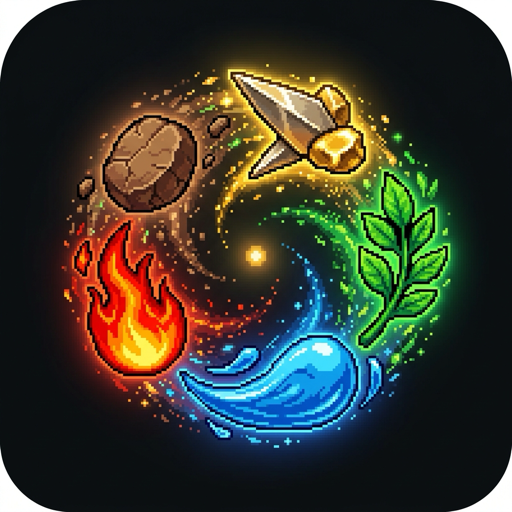
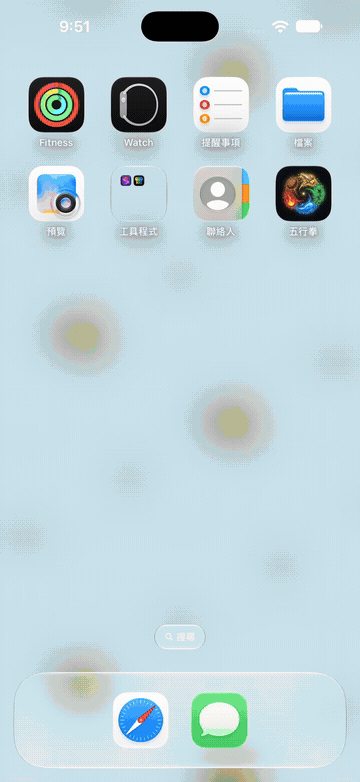
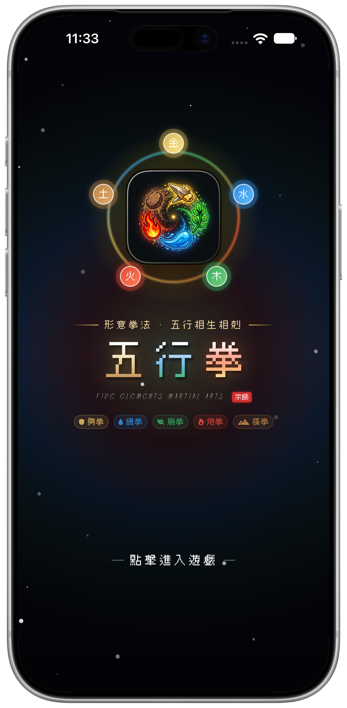
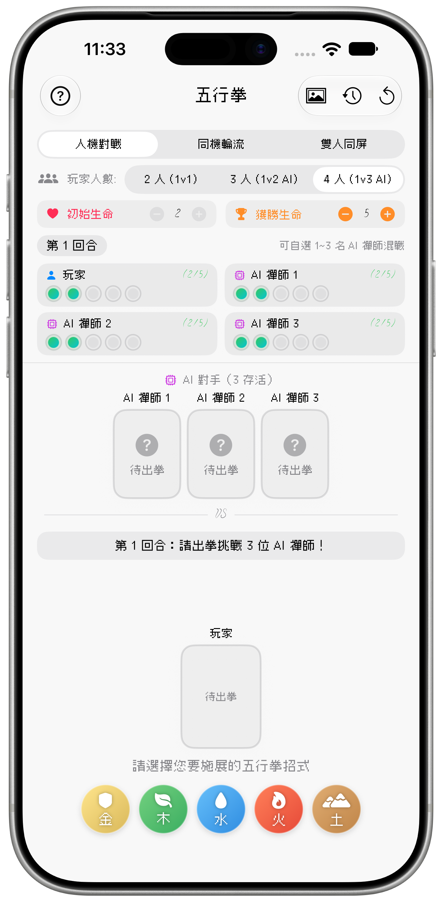
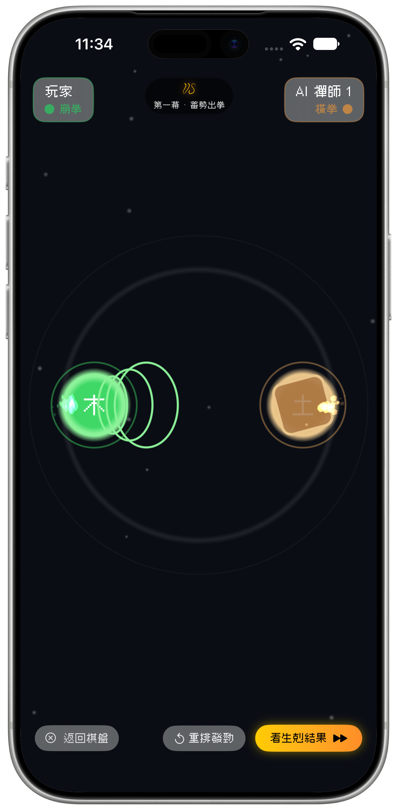
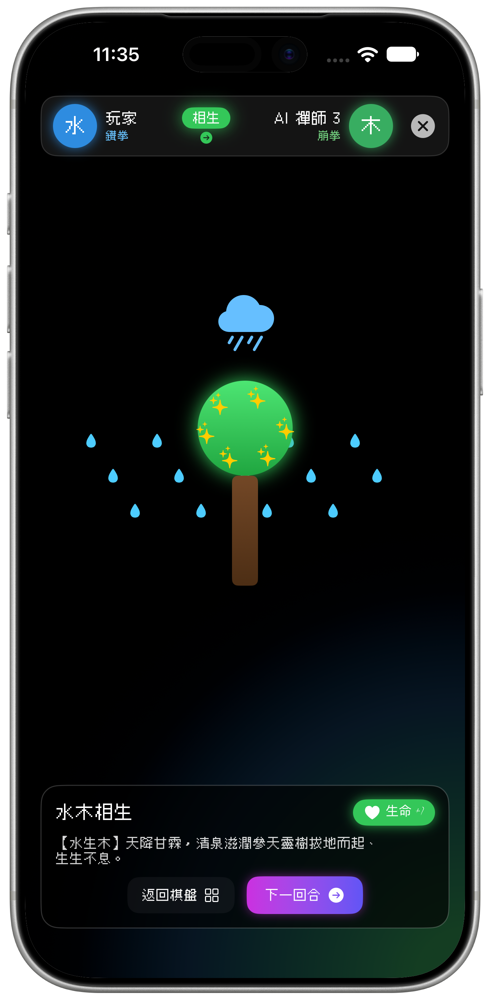
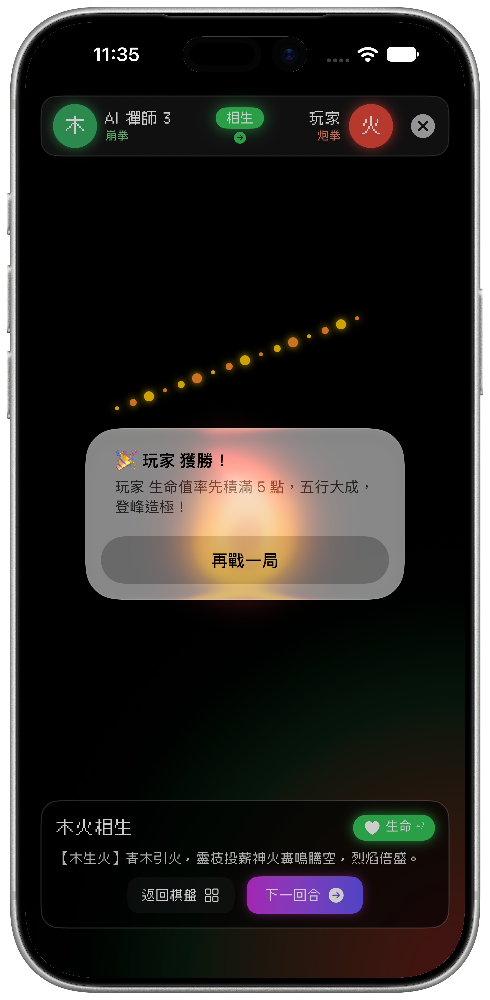
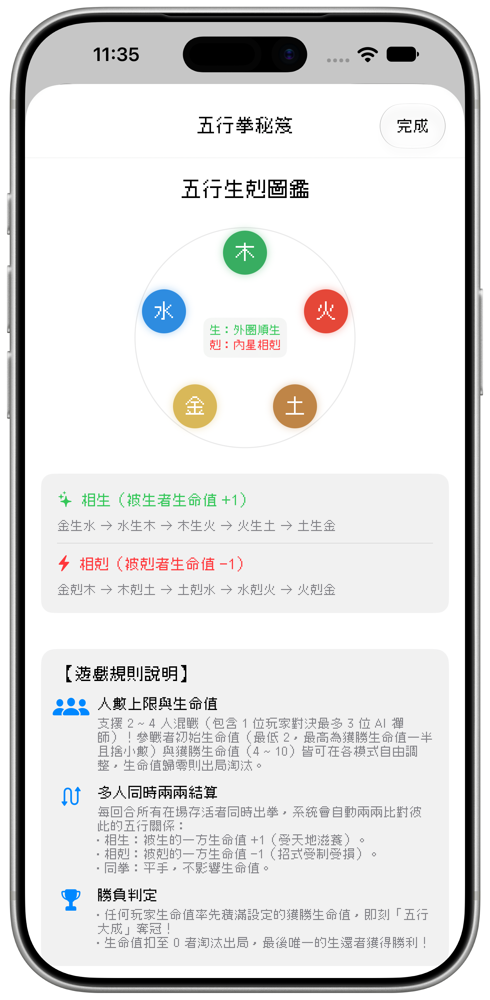

<a id="top"></a>
<div align="center">



# 🥋 五行拳 · Five Elements Martial Arts

### *Xingyi Fist Meets the Cosmic Cycle of Five Elements*
### *形意拳法 · 五行相生相剋 · 國風禪意對戰手遊*

---

[](https://apple.com)
[](https://swift.org)
[](https://developer.apple.com/xcode/swiftui/)
[](https://developer.apple.com/documentation/spritekit)
[](https://developer.apple.com/documentation/observation)
[](LICENSE)

<br/>

**[ 🇬🇧 English Version ](#english-version) &nbsp;•&nbsp; [ 🇹🇼 繁體中文版 ](#chinese-version)**

</div>

---

<a id="english-version"></a>
# 🇬🇧 English Documentation

> **Five Elements Martial Arts (五行拳)** is an authentic Chinese martial arts turn-based strategy game built natively for iOS. Based on traditional Chinese metaphysics (*Wuxing* cycle of generation and overcoming) and Xingyi Quan (Form-Intention Fist), it merges tactical rock-paper-scissors mechanics with dynamic elemental interactions, cinematic combat particle theater, and multi-player modes.

---

## 🎬 Gameplay Demonstration

<div align="center">
  
  <p><em>⚡️ High-framerate fluid combat animations, elemental particles, and live clash resolution.</em></p>
</div>

---

## 📸 App Screenshots Showcase

| 🥋 **Cosmic Cover** | ⚔️ **Battle Arena** | 💥 **Fist Clash Stage** |
| :---: | :---: | :---: |
|  |  |  |
| *Mystical Bagua & Wuxing Ring* | *Multi-Player Dashboard & HP Trackers* | *Cinematic Act I: Charge & Clash* |

| 🌊 **Synergy Theater** | 🏆 **Victory Screen** | 📜 **Secret Manual & Rules** |
| :---: | :---: | :---: |
|  |  |  |
| *Elemental Poems & Particle FX* | *Grand Champion Celebration* | *Generating & Overcoming Matrix* |

---

## 🌟 Key Features

- ☯️ **Authentic Xingyi Five Elements Fists**:
  - 🛡️ **Metal (金) · Splitting Fist (劈拳)**: Hard, sharp, downwards chop like a battle axe.
  - 🌿 **Wood (木) · Crushing Fist (崩拳)**: Direct, piercing blast like an unstoppable arrow.
  - 💧 **Water (水) · Drilling Fist (鑽拳)**: Fluid, deceptive, spiraling upward like a vortex.
  - 🔥 **Fire (火) · Cannon Fist (炮拳)**: Explosive, fiery outburst like thunder and flames.
  - ⛰️ **Earth (土) · Crossing Fist (橫拳)**: Solid, heavy, grounded strike with immense stability.
- 🔄 **Generating & Overcoming Dual Cycle**:
  - **Generating (相生)**: The generated participant absorbs celestial essence and gains **+1 HP**!
  - **Overcoming (相剋)**: The overcome participant takes elemental counter damage and loses **-1 HP**!
  - **Parity / Mirror**: Same elements clash harmlessly without health penalty.
- 🎮 **3 Distinct Game Modes**:
  - 🤖 **PvE Solo Duel vs AI (人機對戰)**: Challenge 1 to 3 AI Zen Masters in simultaneous brawls.
  - 📱 **Local Pass & Play (同機輪流)**: Support 2~4 players taking turns to lock in their secret technique blindly on one device.
  - 👥 **Tabletop Dual Screen (雙人同屏)**: Split-screen head-to-head face-off designed for tabletop iPad/iPhone dueling.
- ⚙️ **Customizable Match Rules**:
  - Adjustable Initial Health (min 2, max half of winning target).
  - Target Winning Health (4 ~ 10 HP) to adapt match pace from blitz to marathon.
- 🎆 **SpriteKit + SwiftUI Particle Theater**:
  - Multi-act cinematic camera showdown with customized elemental shaders, particle bursts, and poetic commentary.
- 📜 **Interactive Secret Manual**:
  - Built-in live visual diagram and elemental codex for beginners and masters alike.

---

## ⚔️ The Wuxing Combat Matrix

| Element | Technique | Generates (+1 HP) | Overcomes (-1 HP) | Essence & Poetic Narration |
| :---: | :---: | :---: | :---: | :--- |
| **Metal (金)** | 劈拳 (*Splitting*) | Water (水) | Wood (木) | 堅剛肅殺，金生水剋木。利刃破空斬參天巨樹。 |
| **Wood (木)** | 崩拳 (*Crushing*) | Fire (火) | Earth (土) | 生發條達，木生火剋土。青木巨根如神龍破厚土。 |
| **Water (水)** | 鑽拳 (*Drilling*) | Wood (木) | Fire (火) | 潤下靈動，水生木剋火。狂浪傾盆滔天滅烈焰。 |
| **Fire (火)** | 炮拳 (*Cannon*) | Earth (土) | Metal (金) | 炎上熾烈，火生土剋金。高溫烈焰銷鑠百煉金刀。 |
| **Earth (土)** | 橫拳 (*Crossing*) | Metal (金) | Water (水) | 承載孕育，土生金剋水。崇山巨石如天降神壁截狂瀾。 |

---

## 🏗️ Technical Architecture

- **Language & Frameworks**: Swift 5.9 / 6.0, SwiftUI, SpriteKit
- **State Management**: Swift Observation framework (`@Observable FiveElementsGameViewModel`)
- **UI & Design**: Cyberpunk Neo-Wuxia, Glassmorphism backdrop materials, custom typography (`Cubic_11`, `ELEMENTAL`, `Elements`)
- **Animation System**:
  - Declarative SwiftUI timeline animations
  - SpriteKit particle emitters for sparks, embers, rain, falling leaves, and rock bursts
  - Haptic feedback integration

```
五行拳/
├── ___App.swift                  # App entry point
├── Models.swift                  # FiveElement enum, Combat matrix, Player model
├── GameViewModel.swift           # Game loop logic, Pairwise resolution, State machine
├── Views.swift                   # Reusable UI components & Game mode selectors
├── ContentView.swift             # Main battle arena view
├── GameCoverView.swift           # Title screen & Ring animation
├── FullScreenClashViews.swift    # Fist clash animations & timing
├── FullScreenTheaterView.swift   # Elemental interactions & narrative theater
├── AnimationViews.swift          # Floating runes & glow effects
├── SpriteKitHelpers.swift        # Particle scenes & emitter adapters
├── ElementFont.swift             # Typography loader
└── Fonts/                        # Embedded custom pixel & elemental TTF fonts
```

---

## 🚀 Getting Started

### Prerequisites
- macOS Sonoma 14.0 or later
- Xcode 15.0+ or Xcode 16.0+
- iOS 17.0+ Simulator or physical device

### Installation
1. Clone this repository:
   ```bash
   git clone https://github.com/linhung2222/-.git
   cd -
   ```
2. Open the project in Xcode:
   ```bash
   open 五行拳.xcodeproj
   ```
3. Select your desired simulator or connected iOS device (iPhone 15 / 16 / 17 Pro Max recommended).
4. Press `Cmd + R` to build and run!

---

<div align="center">
  <p><a href="#chinese-version">👉 切換至繁體中文版本 (Jump to Traditional Chinese) 👈</a></p>
  <p><a href="#top">⬆️ 回到頂部 (Back to Top)</a></p>
</div>

<br/>
<hr/>
<br/>

<a id="chinese-version"></a>
# 🇹🇼 繁體中文說明文件

> **五行拳（Five Elements Martial Arts）** 是一款融合傳統中華武術「形意五行拳」與「陰陽五行生剋」哲學的 iOS 原生策略對戰手遊。將經典猜拳機制昇華為兼具攻防、相生相剋、血量運營與心理博弈的沉浸式對弈體驗。

---

## 🎬 遊戲操作動態展示

<div align="center">
  
  <p><em>⚡️ 真機流暢操作體驗、即時五行粒子爆發與全螢幕生剋大戲院。</em></p>
</div>

---

## 📸 遊戲實機截圖精選

| 🥋 **五行八卦封面** | ⚔️ **主對弈棋盤** | 💥 **第一幕：蓄勢出拳** |
| :---: | :---: | :---: |
|  |  |  |
| *流光環繞 · 國風禪意開場* | *多模式切換 · 即時血量珠槽* | *拳勢對撞 · 靈光環形交鋒* |

| 🌊 **生剋視覺大戲院** | 🏆 **大成登峰結算** | 📜 **五行拳秘笈手冊** |
| :---: | :---: | :---: |
|  |  |  |
| *詩意批註 · 元素天地異象* | *五行大成 · 登峰造極金榜* | *生剋圖鑑 · 規則參數指南* |

---

## 🌟 核心特色

- ☯️ **形意拳五行拳式完美還原**：
  - 🛡️ **金 · 劈拳**：如斧劈擊，剛猛下沉，金氣肅殺。
  - 🌿 **木 · 崩拳**：如箭離弦，直透敵陣，生機勃發。
  - 💧 **水 · 鑽拳**：如浪翻湧，靈動鑽擊，潤下莫測。
  - 🔥 **火 · 炮拳**：如烈火炸裂，暴烈疾速，炎上焚天。
  - ⛰️ **土 · 橫拳**：如山嶽厚重，內涵乾坤，承載萬物。
- 🔄 **五行「相生」與「相剋」雙軌結算**：
  - **相生（受天地滋養）**：被生的一方獲得氣血滋補，**生命值 +1**！
  - **相剋（受招式克制）**：被剋的一方招式受損，**生命值 -1**！
  - **同拳平手**：兩者招式相互抵銷，生命值不變。
- 👥 **三種獨創對戰模式**：
  - 🤖 **人機對戰（PvE）**：支援 1 位玩家對抗 1 至 3 位 AI 禪師的混戰對抗。
  - 📱 **同機輪流（Pass & Play）**：2 至 4 位好友同拿一支手機，輪流遮蔽出拳、隱密暗選。
  - 👥 **雙人同屏（Face-to-Face）**：兩人面對面各執一端，考驗出拳反應與心理預判。
- 🎛️ **自由自訂戰局長度**：
  - 初始生命值：可彈性調整（最低 2 點，上限為獲勝生命的一半）。
  - 獲勝生命值：4 ~ 10 點自由設定，節奏由你作主。
- 🎆 **電影級「生剋大戲院」**：
  - 結合 SpriteKit 粒子特效與 SwiftUI 彈性動畫，以「第一幕蓄勢出拳 ➜ 第二幕兩兩生剋 ➜ 第三幕戰果揭曉」三階段視覺呈現每回合交鋒。
- 📜 **內建五行拳秘笈**：
  - 點擊標題旁問號即可調出五行生剋圖鑑與詳細規則教學，新手亦能迅速參悟五行奧妙。

---

## 📜 五行生剋對照表

| 五行屬性 | 形意拳式 | 相生關係（被生者生命 +1） | 相剋關係（被剋者生命 -1） | 典籍意象與出招旁白 |
| :---: | :---: | :---: | :---: | :--- |
| **金** | 劈拳 | 金生水 💧 | 金剋木 🌿 | 【金生水】靈刃化泉，源源不絕。<br/>【金剋木】利刃破空，大刀橫斬參天巨樹！ |
| **木** | 崩拳 | 木生火 🔥 | 木剋土 ⛰️ | 【木生火】青木引火，靈枝投薪神火騰空。<br/>【木剋土】青木盤根，巨根如神龍破崩厚土！ |
| **水** | 鑽拳 | 水生木 🌿 | 水剋火 🔥 | 【水生木】天降甘霖，清泉滋潤靈樹拔地而起。<br/>【水剋火】狂浪傾盆，滔天巨浪澆滅烈火！ |
| **火** | 炮拳 | 火生土 ⛰️ | 火剋金 🛡️ | 【火生土】神火焚化，岩漿冷卻凝為深厚沃土。<br/>【火剋金】烈火焚天，高溫烈焰銷鑠百煉神鋒！ |
| **土** | 橫拳 | 土生金 🛡️ | 土剋水 💧 | 【土生金】厚土裂地，地脈靈氣化為神鋒破土。<br/>【土剋水】崇山築堤，巨石如天降神壁截斷大水！ |

---

## 🏆 勝負判定規則

1. **五行大成（獲勝）**：
   - 任一玩家之生命值率先累積達到設定的「獲勝生命值」，即刻「五行大成，登峰造極」，成為天下第一宗師！
2. **力竭出局（淘汰）**：
   - 生命值被扣減至 0 者淘汰出局；在多人混戰中，若僅剩一名倖存者，該存活者亦獲得最後勝利！

---

## 🛠️ 開發技術棧與設計亮點

- **核心技術**：Swift 5.9 / 6.0、SwiftUI、SpriteKit 粒子系統
- **架構設計**：Apple 最新 Observation 響應式架構（`@Observable`），解耦資料流與介面渲染
- **美術視覺**：
  - 新中式國風（Cyber-Wuxia）與深空宇宙背景
  - 毛玻璃擬態（Glassmorphism）卡片與按鈕
  - 專屬定制字體：像素風 `Cubic_11`、古典符文 `ELEMENTAL` & `Elements`
- **動畫系統**：
  - SwiftUI TimelineView 原生流光與呼吸縮放光暈
  - 兩兩出拳碰撞的物理慣性回彈與衝擊波環

---

## 💻 專案運行指引

### 環境要求
- macOS Sonoma 14.0 或更高版本
- Xcode 15.0+ 或 Xcode 16.0+
- iOS 17.0+ 模擬器或真機設備

### 快速開始
1. 複製專案庫到本機：
   ```bash
   git clone https://github.com/linhung2222/-.git
   cd -
   ```
2. 使用 Xcode 開啟專案：
   ```bash
   open 五行拳.xcodeproj
   ```
3. 在 Xcode 頂部目標選單選擇運行設備（推薦使用 iPhone 15 / 16 / 17 Pro Max 體驗最佳視覺比例）。
4. 按下 `Cmd + R` 編譯並啟動應用程式。

---

## 📄 開源許可證

本專案採用 [MIT License](LICENSE) 開源授權，歡迎學習、研究與武術文化推廣交流！

---

<div align="center">
  <p><a href="#english-version">👉 Switch to English Version 👈</a></p>
  <p><a href="#top">⬆️ 回到頂部 (Back to Top)</a></p>
  <br/>
  <p>Made with ❤️ & Martial Arts Spirit</p>
</div>
